<div align="center">
  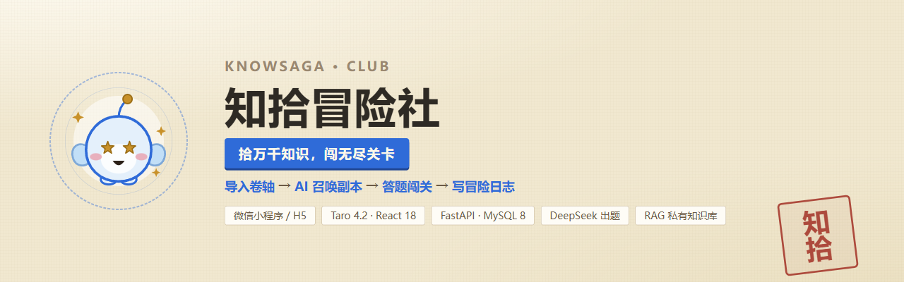
</div>

<div align="center">

**把资料变成一场冒险** —— 导入卷轴，AI 召唤知识副本，答题闯关，写下冒险日志。

[](https://taro.zone/)
[](https://react.dev/)
[](https://www.typescriptlang.org/)
[](https://fastapi.tiangolo.com/)
[](https://www.python.org/)
[](https://www.mysql.com/)
[](https://platform.deepseek.com/)
[](#)

</div>

---

## 这是什么

**知拾冒险社** 是一个跑在微信里（小程序 / H5 双端）的**知识闯关应用**。

你给它一句话、一段文字、一个网址，或者一份自己的文档；它联网取材、调用大模型出题，
生成一套带选项、答案与逐题讲解的闯关题目 —— 你答完一局，它会再写一份包含正确率、
三句话知识总结与复习建议的**冒险日志**，并把错题按遗忘曲线排进复习计划。

整个产品用一套「冒险公会」的世界观包装，但底层业务就是一条清晰的学习闭环：

| 世界观名词 | 实际功能 |
| --- | --- |
| 领取冒险卷轴 | 导入资料（一句话 / 文本 / 网址 / 文档） |
| 召唤知识副本 | AI 联网取材 + 生成题库（异步任务 + 进度可见） |
| 挑战副本 | 答题闯关（单选题 / 多选题 / 判断题） |
| 旧识重温 | 按艾宾浩斯遗忘曲线复习错题 |
| 冒险日志 | 复盘报告（正确率 / 知识总结 / 复习建议） |
| 冒险者档案 | 个人成长体系（等级 / XP / 勋章 / 知识树 / 数据看板） |
| 小精灵「拾拾」 | 引导角色 |

> **设计语言**：「纸与印」。羊皮纸底 + 墨色文字 + 朱砂印章 + 黄铜星星，
> 所有页面尺寸与配色都以 `prototype/` 里的 HTML 原型实渲染为准。

---

## 一次完整的冒险

从启动到复盘，一共 10 屏。下面的截图**全部来自本机真实运行**（H5 构建 + 真实后端 +
真实 DeepSeek / Tavily / 向量库调用），数据也是库里的真实记录。

<table>
<tr>
  <td align="center">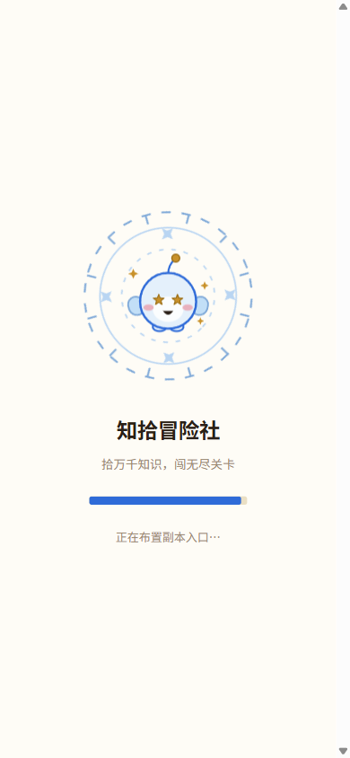</td>
  <td align="center">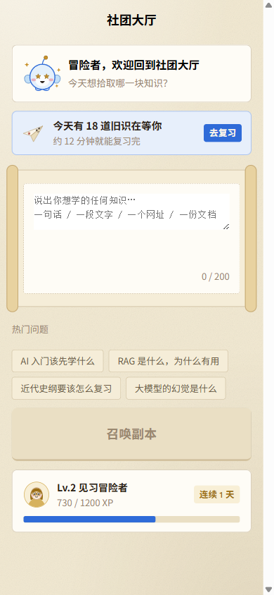</td>
  <td align="center">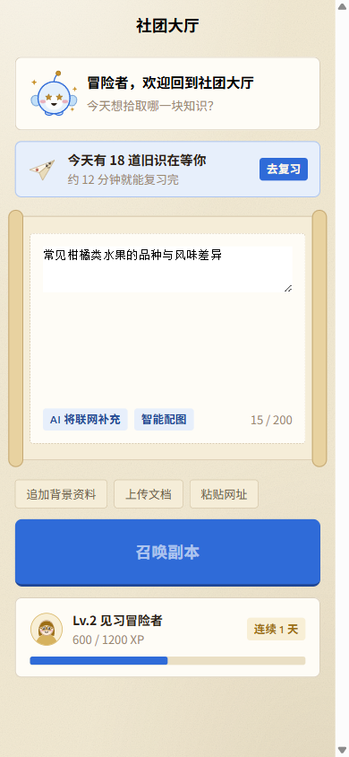</td>
  <td align="center">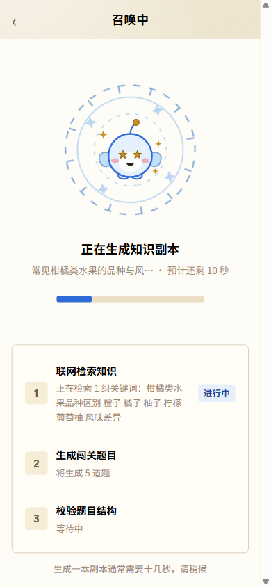</td>
</tr>
<tr>
  <td align="center"><b>① 启动页</b><br>拾拾与法阵，<br>随后进入社团大厅</td>
  <td align="center"><b>② 社团大厅</b><br>一个输入框就是全部入口，<br>下方是热门问题与成长条</td>
  <td align="center"><b>③ 两个开关</b><br>输入后出现「是否联网取材」<br>与「是否生成配图」</td>
  <td align="center"><b>④ 召唤中</b><br>三步进度可见：<br>检索 → 出题 → 校验结构</td>
</tr>
</table>

出题完成后先给你一张「副本说明」（题型构成 + 本次覆盖的知识点），确认无误再开始：

<table>
<tr>
  <td align="center">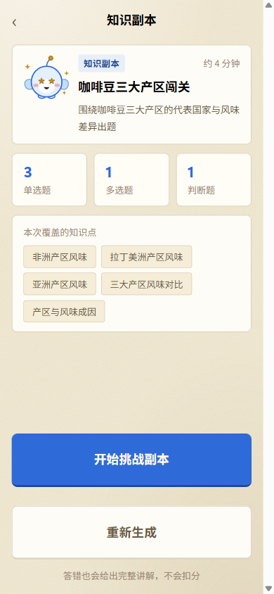</td>
  <td align="center">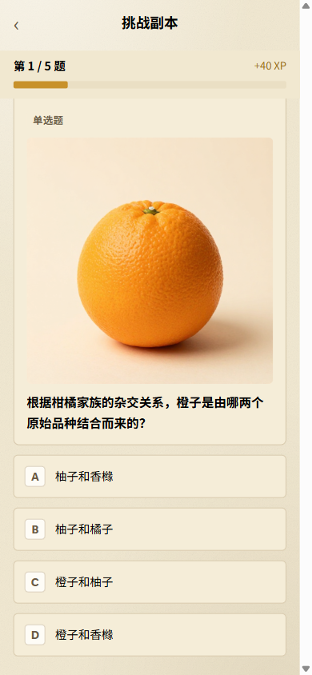</td>
  <td align="center">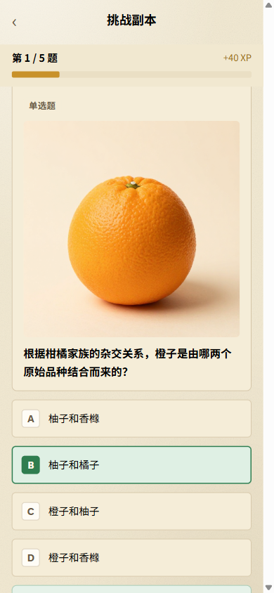</td>
  <td align="center">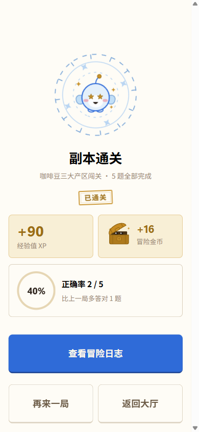</td>
</tr>
<tr>
  <td align="center"><b>⑤ 知识副本</b><br>题型构成 + 知识点覆盖，<br>不满意可以「重新生成」</td>
  <td align="center"><b>⑥ 答题（带配图）</b><br>AI 会先挑出值得配图的题，<br>再逐题生成插图</td>
  <td align="center"><b>⑦ 即时讲解</b><br>答对答错都给完整讲解，<br>答错不扣分</td>
  <td align="center"><b>⑧ 结算</b><br>XP / 金币 / 正确率，<br>并与上一局对比</td>
</tr>
</table>

通关后的冒险日志是整个闭环的收尾：不止给分数，还给出**可执行**的复盘。

<table>
<tr>
  <td align="center">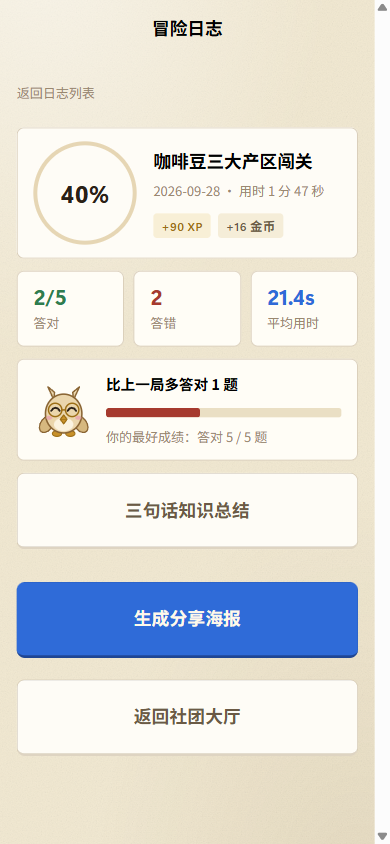</td>
  <td align="center">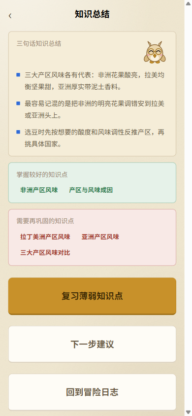</td>
  <td align="center">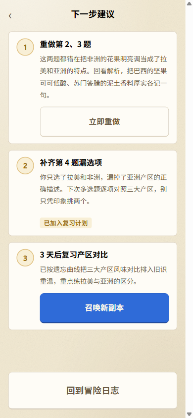</td>
  <td align="center">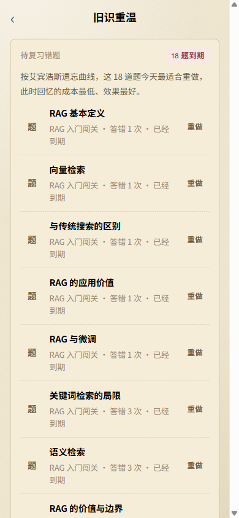</td>
</tr>
<tr>
  <td align="center"><b>⑨ 冒险日志</b><br>正确率圆环 / 答对答错 /<br>平均用时 / +XP +金币</td>
  <td align="center"><b>⑩ 三句话总结</b><br>AI 把这一局压缩成三句话，<br>并列出掌握与待巩固的知识点</td>
  <td align="center"><b>复习建议</b><br>逐题说明错在哪、<br>下一步该重做哪道</td>
  <td align="center"><b>旧识重温</b><br>错题按遗忘曲线到期，<br>到点提醒你重做</td>
</tr>
</table>

---

## 功能一览

### 三种题型与作答反馈

题目由 AI 生成，单选 / 多选 / 判断都支持，每道题答完立即给出讲解与「相关知识点」。

<table>
<tr>
  <td align="center">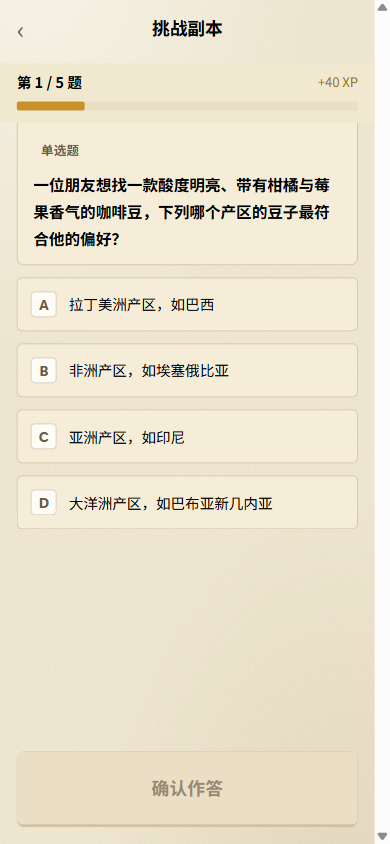</td>
  <td align="center">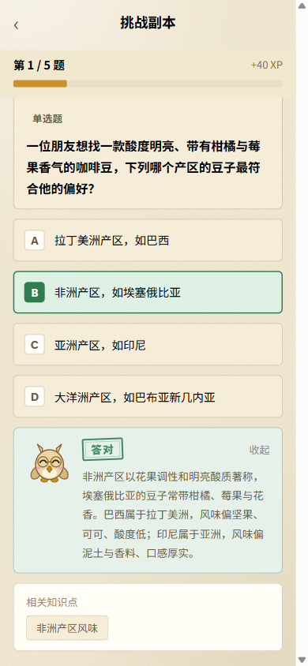</td>
  <td align="center">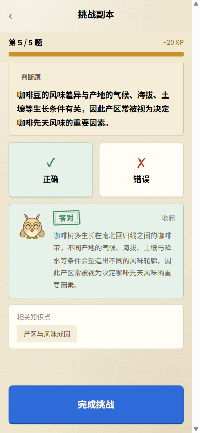</td>
</tr>
<tr>
  <td align="center"><b>单选题</b><br>纯文字题（未开配图）</td>
  <td align="center"><b>作答反馈</b><br>对与错都展开完整讲解</td>
  <td align="center"><b>判断题</b><br>最后一题答完即生成日志</td>
</tr>
</table>

**配图是可选项**（大厅那枚「智能配图」开关，默认关）。开了之后，AI 会**先判断哪几道题
值得配图**，再只给那几道生成插图 —— 抽象概念题画出来对理解没有增益，这一步是为了省成本。
生图任何一环失败也只让那道题没有图，不会把整次出题拖垮。

### 卷轴工坊 · 导入资料

四种输入来源，各自的实现现状在页面里如实标注（不做「占位但看起来能用」的入口）。

<table>
<tr>
  <td align="center"></td>
  <td align="center"></td>
  <td align="center">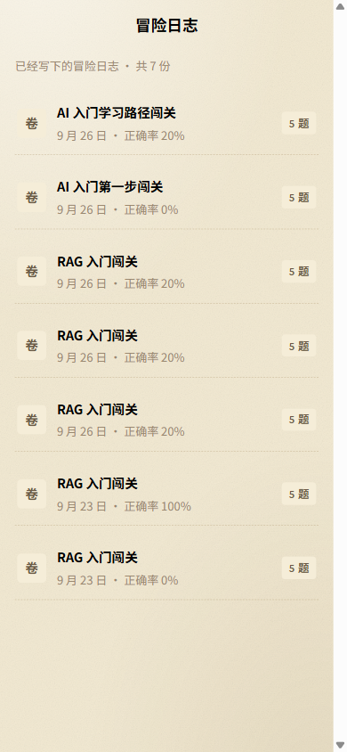</td>
</tr>
<tr>
  <td align="center"><b>卷轴工坊</b><br>知识库与输入方式的入口</td>
  <td align="center"><b>私有知识库</b><br>PDF / Word / Markdown / TXT<br>上传即解析入库</td>
  <td align="center"><b>冒险日志列表</b><br>历史每一局都可回看</td>
</tr>
</table>

**私有知识库（RAG）**：上传的文档会被解析、分块、向量化，然后作为**第三个取材工具**
交给模型，与「联网检索」「用户给的链接」并列，由模型自己决定用哪个。
资料按用户隔离，且「不是你的」与「不存在」在任何知识库接口上返回**同一个错误码** —— 不泄露别人有什么。

### 成长体系 · 冒险者档案

<table>
<tr>
  <td align="center">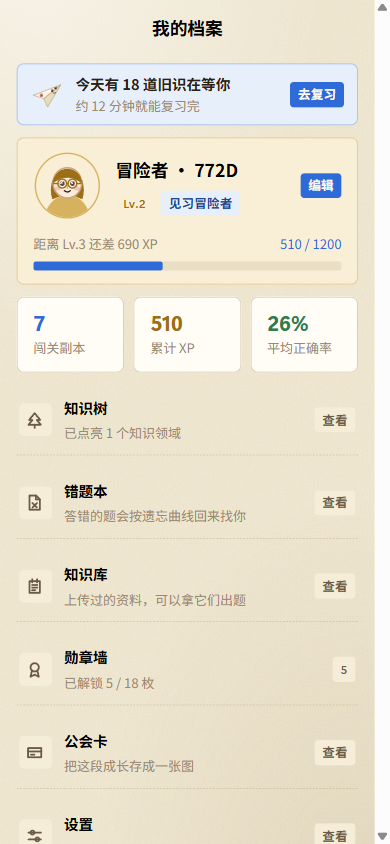</td>
  <td align="center">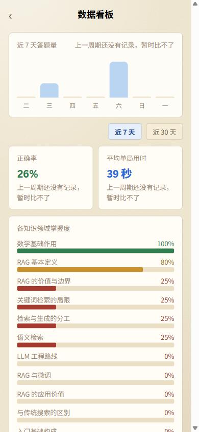</td>
  <td align="center">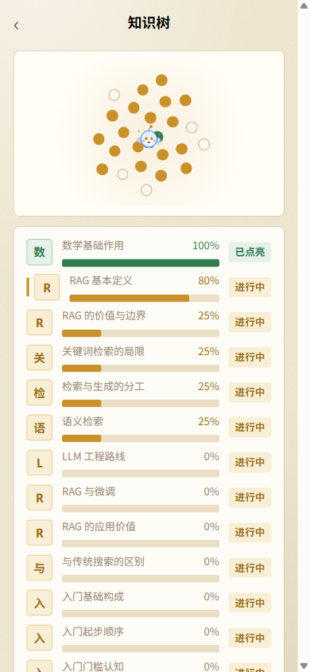</td>
  <td align="center">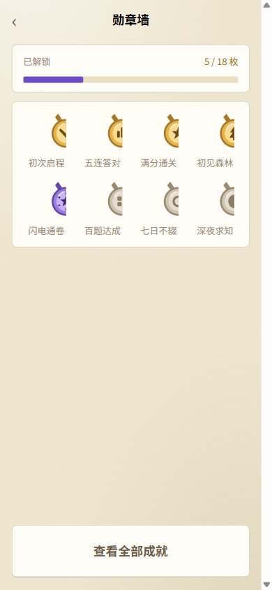</td>
</tr>
<tr>
  <td align="center"><b>我的档案</b><br>等级 / XP / 连击 / 统计</td>
  <td align="center"><b>数据看板</b><br>答题量、正确率、用时趋势</td>
  <td align="center"><b>知识树</b><br>按知识点聚合的掌握度</td>
  <td align="center"><b>勋章墙</b><br>18 枚成就，条件达成即解锁</td>
</tr>
</table>

<table>
<tr>
  <td align="center">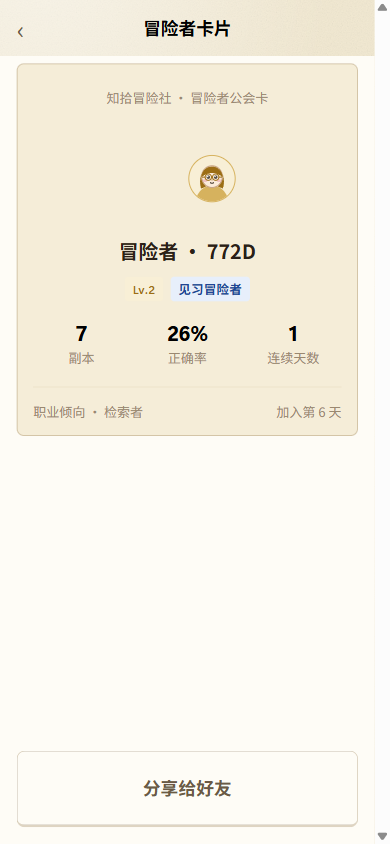</td>
  <td align="center">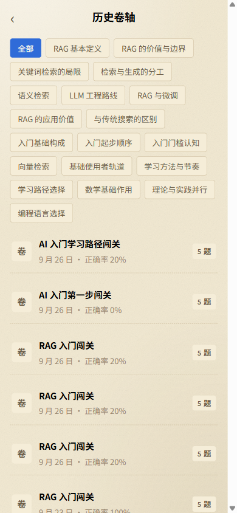</td>
  <td align="center">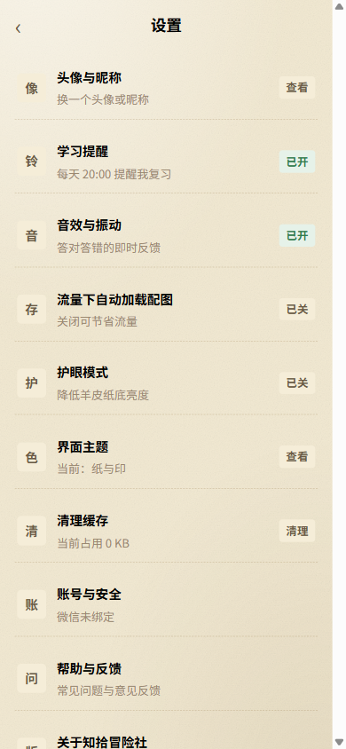</td>
</tr>
<tr>
  <td align="center"><b>冒险者公会卡</b><br>Canvas 生成可分享的卡片</td>
  <td align="center"><b>历史卷轴</b><br>按知识点归档的过往记录</td>
  <td align="center"><b>设置</b><br>头像昵称 / 提醒 / 音效 / 主题…</td>
</tr>
</table>

### 界面主题 · 五套配色

设置页 →「界面主题」，五套预设，**切换即时全局生效**，并且偏好跟着账号走（换设备也是同一套）。

<table>
<tr>
  <td align="center">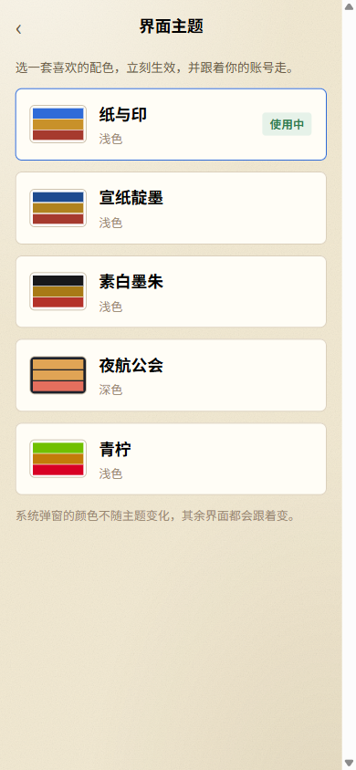</td>
  <td align="center">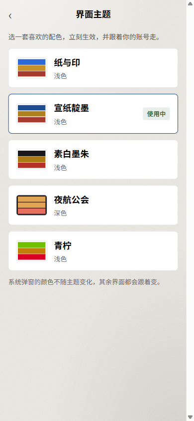</td>
  <td align="center">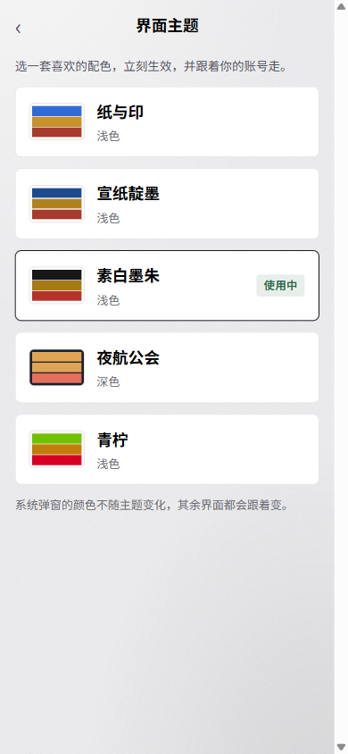</td>
</tr>
<tr>
  <td align="center"><b>纸与印</b>（默认）</td>
  <td align="center"><b>宣纸靛墨</b></td>
  <td align="center"><b>素白墨朱</b></td>
</tr>
</table>

<table>
<tr>
  <td align="center">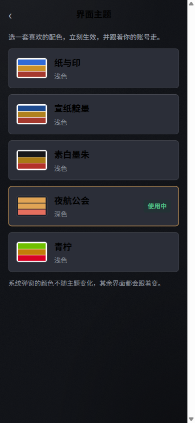</td>
  <td align="center">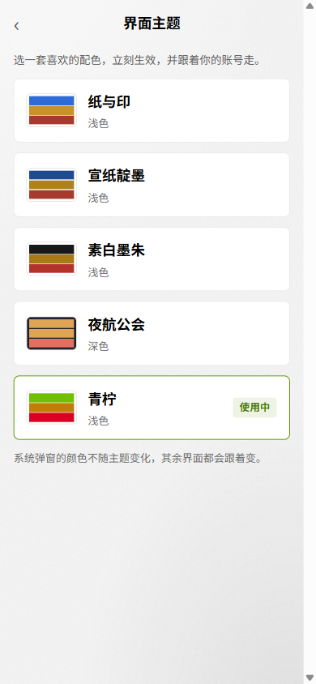</td>
</tr>
<tr>
  <td align="center"><b>夜航公会</b>（深色）</td>
  <td align="center"><b>青柠</b></td>
</tr>
</table>

实现上有三条刻意的选择：

- **默认主题零视觉漂移**：默认主题不挂任何类名，颜色走 `var(--k-*, 原字面量)` 的
  fallback —— 「不换肤时和以前一模一样」是**构造保证**，不是靠事后比对。
- **主题色值只有一份真源**：`shared/ui-themes.json` 定义 4 套非默认主题的核心色，
  由脚本派生全部令牌并生成 `_themes.scss`（生成物入库），`check:theme` 负责守住一致性。
- **覆盖不到的地方如实说**：微信原生弹窗与轻提示（`showModal` / `showToast`）不在 WebView 里，
  颜色改不动，页面底部就直接写明这一条，不假装全部跟随。

---

## 技术栈

| 层 | 选型 |
| --- | --- |
| 前端 | Taro 4.2.1（微信小程序 + H5 双端）· React 18.3.1 · TypeScript 5 · Sass · Zustand 5 |
| 后端 | Python 3.12 · FastAPI · Pydantic v2 · SQLAlchemy 2.0 · PyMySQL |
| 数据库 | MySQL 8.0+（`utf8mb4_0900_ai_ci`） |
| 模型 | DeepSeek（出题链 + 复盘链，结构化输出走 `json_mode`，失败降级 `function_calling`） |
| 检索 | Tavily（关键词检索 + 按 URL 抓整页），交给模型自主决定调用，轮次/次数/时长都有硬上限 |
| 向量 | 阿里云百炼 `text-embedding-v4` + Chroma（按用户隔离） |
| 生图 | 百炼 `z-image-turbo` → 转存腾讯云 COS（上游链接 24 小时过期，必须换永久 URL） |
| 鉴权 | 微信静默登录（`wx.login` → `code2Session`）+ 自签 JWT |
| 部署 | 微信云托管（`backend/Dockerfile`） |

---

## 架构

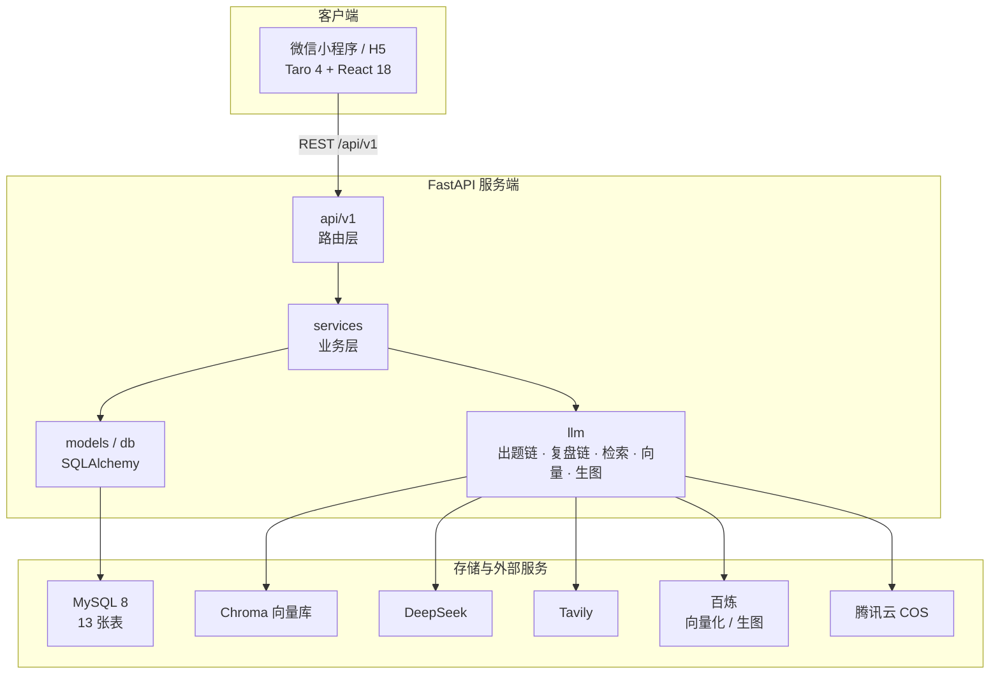

几条贯穿全局的工程约定：

- **出题是异步任务 + 轮询**，不是一次长请求。任务进度与登录限流都是**进程内内存**，
  所以部署时 `--workers` 必须为 1、实例数固定为 1（多进程会让轮询打到别的进程上）。
- **所有接口统一返回 `{code, message, data}`**，异常在全局处理器里收敛成同一形态。
- **降级不崩**：配图任何一环失败只让那道题没有图，题目照常返回；
  取材超限就带着已有资料收尾；模型输出两次都不合规就快速失败让用户重试。
- **如实优于好看**：开关关掉时前端隐藏入口而不是留一个点了必失败的按钮；
  配图额度不足时在创建任务**之前**拒绝并提示「关掉配图即可继续」。

---

## 快速开始

### 0. 前置

- Python **3.12+**（`backend/pyproject.toml` 要求 `>=3.12`；依赖链里的 numpy 2.5 也是）
- Node.js 18+
- MySQL **8.0+**（必须 8.0 以上：库表统一用 `utf8mb4_0900_ai_ci`）
- 一把 DeepSeek API Key（**必填**，缺它出题接口直接失败）

### 1. 准备环境变量

```bash
cp .env.example .env
```

`.env` 里**每一项都有注释说明为什么这么填**，按需修改。最少要填的是：

```ini
DEEPSEEK_API_KEY=sk-xxxxxxxx        # 必填
JWT_SECRET=<32 位以上的随机串>        # 必填
DATABASE_URL=mysql+pymysql://<user>:<password>@127.0.0.1:3306/knowsaga_club?charset=utf8mb4
TEST_DATABASE_URL=mysql+pymysql://<user>:<password>@127.0.0.1:3306/knowsaga_club_test?charset=utf8mb4
DEV_LOGIN_ENABLED=true              # 本地 H5 联调需要；生产必须 false
```

> `JWT_SECRET` 生成：`python -c "import secrets; print(secrets.token_urlsafe(48))"`
>
> `.env` 已被 `.gitignore` 忽略，**永不入库**。提交前请跑 `python tools/scan_secrets.py`。

联网检索 / 私有知识库 / 题目配图三组是**可选能力**，各自的开关与依赖 Key 见 `.env.example`；
不配它们时对应入口会在前端隐藏，其余功能不受影响。

### 2. 建库建表

按顺序执行 `backend/sql/` 下的脚本：

```bash
mysql -u root -p < backend/sql/00_create_databases.sql   # 建业务库 + 测试库
mysql -u root -p < backend/sql/01_schema.sql             # 建表
# 02 ~ 09 是增量迁移，按编号顺序执行
```

### 3. 起后端

```bash
cd backend
python -m venv .venv
.venv/Scripts/pip install -r requirements.txt      # Windows
# source .venv/bin/activate && pip install -r requirements.txt   # macOS / Linux

.venv/Scripts/python.exe -m uvicorn app.main:app --port 8000
```

启动日志会打印一份配置摘要（模型、数据库、各类开关、密钥是否配齐），
配错的地方会直接标成 `**未配置**` —— 不用等第一个请求失败才发现。

接口文档：<http://127.0.0.1:8000/docs>

### 4. 起前端

```bash
cd frontend
npm install

npm run dev:weapp     # 微信小程序：产物在 frontend/dist，用微信开发者工具打开
npm run dev:h5        # H5：浏览器直接调试
```

> **构建产物目录是共用的**：`dev:weapp` 与 `dev:h5` 都输出到 `frontend/dist`，
> 后跑的会覆盖前一个。要两个都验就串行执行。
>
> **`build:h5` 加载的是 `.env.production`**（指向线上域名）。本地要拿 production
> 产物做浏览器验收，新建一个 `frontend/.env.production.local` 覆盖 API 地址即可
> （该文件已被 `.gitignore` 的 `*.local` 排除）。

### 5. 跑测试

```bash
cd backend
.venv/Scripts/python.exe -m pytest            # 全量
.venv/Scripts/python.exe -m pytest -m integration   # 真实 LLM 调用（默认不跑）
```

前端另有三个脚本级闸门：

```bash
cd frontend
npm run type-check    # tsc --noEmit
npm run check:theme   # 主题令牌一致性 + WCAG 对比度 + 图标像素色
npm run check:scoring # 前后端评分口径一致
```

---

## 项目结构

```
knowsaga-club/
├── backend/                  # FastAPI 服务端
│   ├── app/
│   │   ├── api/v1/routes/    # 路由层：auth / users / quiz / tasks / attempts /
│   │   │                     #         report / review / kb / health
│   │   ├── services/         # 业务层：出题、交卷、成长、勋章、复习、知识库…
│   │   ├── llm/              # 模型层：出题链、复盘链、检索 Agent、向量库、生图
│   │   ├── models/ db/       # Pydantic 模型与 SQLAlchemy 表映射
│   │   ├── prompts/          # 提示词（出题 / 复盘 / 取材 / 配图选题）
│   │   ├── core/             # 配置、常量、安全、限流、响应封装、异常
│   │   └── utils/            # 文本清洗、内容过滤、图片校验、时区…
│   ├── sql/                  # 00 建库 / 01 建表 / 02–09 增量迁移
│   ├── tests/                # 57 个测试文件
│   ├── Dockerfile            # 微信云托管镜像（构建上下文 = backend/）
│   └── pyproject.toml
├── frontend/                 # Taro 前端（小程序 + H5）
│   ├── src/
│   │   ├── pages/            # 32 个注册路由：大厅 / 工坊 / 副本 / 日志 / 档案 / 设置
│   │   ├── components/       # PhoneShell / AccuracyRing / Sprite / MagicStage…
│   │   ├── services/         # 接口层（含登录态续期与并发去重）
│   │   ├── store/            # Zustand
│   │   ├── styles/           # tokens.scss 设计令牌 + 主题生成物
│   │   ├── constants/        # 文案与常量（文案与实现冲突时改这里）
│   │   ├── custom-tab-bar/   # 自定义标签栏（按主题切换图标）
│   │   └── assets/           # 角色 / 图标 / 装饰（含按主题预生成的位图）
│   └── scripts/              # 主题生成与三个一致性闸门
├── shared/                   # 前后端共用的契约数据（主题 / 评分 / 链接用例）
├── prototype/                # HTML 高保真原型 —— **尺寸与配色的唯一真源**
├── openspec/                 # 规格驱动开发：specs 基线 + changes 归档
├── docs/                     # 需求 / 方案 / 开发计划 / 缺陷报告
└── tools/                    # 凭证扫描、类型检查、原型读取
```

---

## 质量与验证

这个项目的验收标准是「**能不能拿出读数**」，不是「看起来没问题」。几个具体做法：

- **后端 TDD**：先写测试跑红（并确认红在预期的那一行），再写实现跑绿。
  全量 `pytest` 是唯一的准入闸门 —— 只跑受影响的模块不算通过。
- **跨语言契约钉子**：前后端各有一份主题 ID / 评分口径 / 链接用例，
  两边同时漂开时**两端各自的测试都是绿的**，所以专门写了断言把它们钉在一起。
- **设计令牌一致性**：`check:theme` 会校验主题生成物与真源同步、逐一复算 WCAG 对比度、
  并解码按主题预生成的标签栏图标位图，断言每个不透明像素的颜色确实等于该主题的令牌。
- **「生成物必须被消费」**：任何由脚本产出的令牌或常量，都量一次「定义数 vs 引用数」。
  这条判据来自两次真实事故 —— 产出物在、但没有任何地方引用它，
  而编译、构建、零漂移比对、可读性体检**全都是绿的**。
- **零漂移是实测的**：改动设计令牌后，会把全部 SCSS 编译产物归一化后与基线**逐字节比对**，
  而不是「看着没变」。
- **真浏览器验收**：前端页面交付前会用真浏览器跑一遍完整链路并**数后端请求**，
  确认页面上的数字确实来自接口，而不是写死的演示数据。

---

## 相关文档

| 文档 | 内容 |
| --- | --- |
| [`docs/需求分析文档.md`](docs/需求分析文档.md) | 产品定位、MVP 范围、功能核对清单 |
| [`docs/方案设计文档.md`](docs/方案设计文档.md) | 技术选型与整体方案 |
| [`docs/用户系统需求分析文档.md`](docs/用户系统需求分析文档.md) | 用户系统与成长体系的需求 |
| [`docs/用户系统方案设计文档.md`](docs/用户系统方案设计文档.md) | 鉴权、数据模型、接口鉴权矩阵 |
| [`docs/MVP开发计划.md`](docs/MVP开发计划.md) | 已锁定的决策与文档纠偏记录 |
| [`docs/OpenSpec使用教程.md`](docs/OpenSpec使用教程.md) | 本项目的规格驱动开发流程 |
| [`openspec/specs/`](openspec/specs/) | 六份能力规格基线 |
| [`prototype/`](prototype/) | HTML 高保真原型（尺寸与配色的真源） |

---

## 部署

后端已备好微信云托管所需的镜像文件（`backend/Dockerfile` + `.dockerignore`，
构建上下文取 `backend/`，避免把前端 `node_modules` 一起传上去）。

上线前**必须**处理这三件事，否则构建与测试全绿、线上却不可用：

1. `frontend/.env.production` 里的 `TARO_APP_API_BASE_URL` 目前是**占位域名**，要换成真实域名并配置
   `request` 合法域名白名单；
2. 云托管自带的 MySQL 要**选 8.0**（默认 5.7 与项目的 `utf8mb4_0900_ai_ci` 不兼容）；
3. 容器内 `uploads/`（头像 + 知识库原文件）与 `vectorstore/` 是**临时的**，
   重启即丢 —— 需先迁到 COS 或挂载存储。

另外云托管的环境变量注入形式（`MYSQL_ADDRESS` 等）与本地 `.env` 不同，需在控制台另行配置。

---

## 说明

- 本项目**未声明开源许可证**，代码与素材版权归作者所有。
- 仓库里的 `prototype/`、`docs/`、`openspec/` 是开发过程的真实产物，
  保留了决策演进与纠偏记录（含已作废的结论，均标注了作废原因）—— 不是给读者看的成品文档，
  但对理解「为什么是这样」比结论本身更有用。
- 所有截图来自本机真实运行，未做美化或合成；为便于阅读只做了等比缩放。
