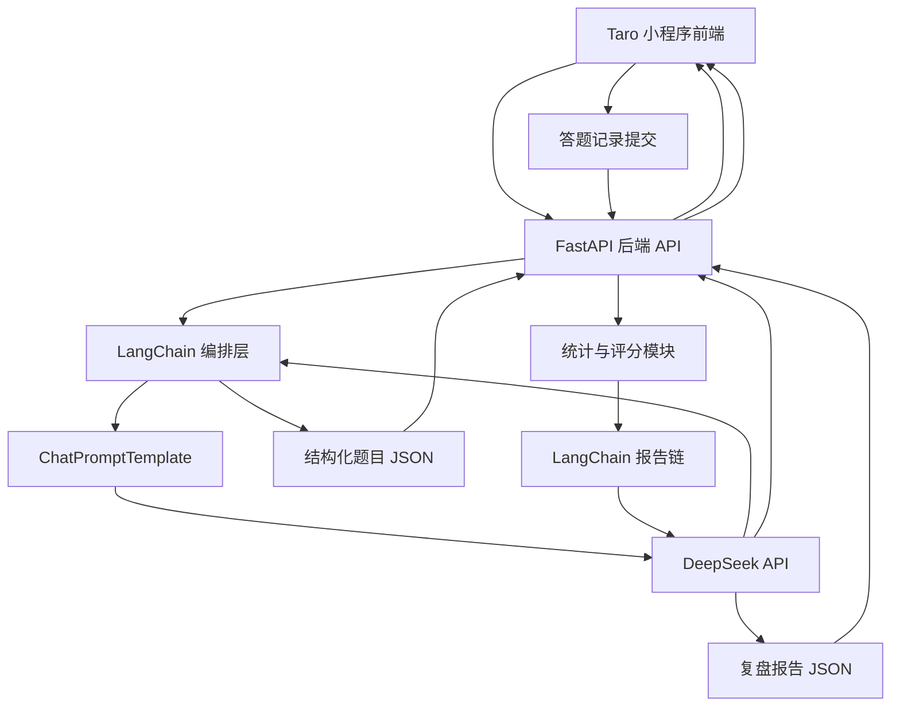

# 《知拾冒险社》方案设计文档

## 1. 文档目标

本文档用于指导“知拾冒险社小程序”从 0 到 1 完成 MVP 方案设计与实施落地，重点解决以下问题：

1. 明确小程序前端技术选型，并给出可执行的推荐结论。
2. 围绕核心业务闭环设计整体架构：用户输入内容 => AI 生成题目 => 用户答题 => AI 生成分析报告。
3. 给出后端技术方案、核心 Prompt 设计、接口协议、领域数据模型和分阶段开发路径。
4. 对需求文档中的 todo 项进行收敛，区分“现在就做”和“后续再做”，避免前期工程失控。

本文档默认遵循以下前提：

- 后端语言采用 Python。
- 后端框架采用 FastAPI。
- 大模型采用 DeepSeek，优先使用 `deepseek-chat`。
- 大模型接入优先走 OpenAI 兼容 API。
- MVP 阶段不以联网搜索、用户系统、数据库建模、多模态为重点。
- MVP 的第一目标不是“功能全”，而是最短路径跑通核心学习闭环。

---

## 2. 需求收敛与 MVP 边界

### 2.1 产品目标

产品本质不是一个“传统题库系统”，而是一个“把任意输入知识快速转成闯关问答”的 AI 学习工具。用户价值主要来自三件事：

1. 降低学习材料处理门槛。
2. 通过问答闯关和即时讲解增强学习参与感。
3. 通过报告复盘形成学习闭环。

### 2.2 MVP 只保留的核心能力

结合需求文档与输出计划，MVP 只保留以下能力：

1. 用户输入一句话、一段文本或一个主题。
2. 后端调用 AI 生成 3 到 5 道题目，题型包含单选、多选、判断。
3. 用户逐题作答，提交后立即得到正确答案和详细讲解。
4. 全部题目完成后，系统生成知识总结、答题统计和复盘报告。

### 2.3 明确不前置的能力

以下能力保留在后续版本，不纳入 MVP 首轮开发：

1. 微信授权登录、用户注册、账号体系。
2. MySQL 正式库表设计与复杂持久化。
3. 网页抓取、PDF/Word/视频解析、联网搜索。
4. RAG 私有知识库、向量数据库。
5. 社交 PK、排行榜、分享裂变深度玩法。
6. 生图、语音、数字人等多模态能力。
7. 复杂商业化功能和支付链路。

> **修订块（2026-09-22，`add-web-search-grounding` 实施期）**：第 3 条的边界被切开，
> 现在分两半看：
>
> - **已前置**：联网搜索（关键词检索）+ 按给定 URL 抓单页正文。触发原因是需求侧的硬伤 ——
>   模型训练数据有截止时间，用户拿新概念（如 Harness Engineering）来出题时，
>   模型会给出**事实层面错误**的理解，而这比少出几道题有害得多。
> - **仍未前置**：爬虫式网页抓取（跟随链接、多页站点）、PDF / Word / 视频解析。
>   本期只读「用户自己在输入里贴出来的链接」与「检索工具返回的网页」，不做主动爬站。
>
> 实现口径见本文 §5.4 的修订块与 `openspec/changes/add-web-search-grounding/design.md`；
> 实测结论见 `docs/MVP开发计划.md` §12.3 / §12.4。

> **修订块（2026-09-24，`add-private-knowledge-base` 实施期）**：第 3、4 条的边界进一步推进 ——
>
> - **已前置**：PDF / Word / Markdown / TXT 的**文档解析**（不做网页爬站、不做视频），
>   以及 **RAG 私有知识库**（向量库 + embedding + 按用户隔离的检索）。
> - **仍未前置**：视频解析、链接型文档（把网页变成一份可管理的文档）、
>   库内章节级的出题范围、新建多库的独立屏。
> - 选型与落地口径见本文 **§14**；需求侧的取舍与偏离登记见
>   `openspec/changes/add-private-knowledge-base/design.md`。

### 2.4 方案设计原则

1. 先验证 AI 出题质量，再做外围系统。
2. 先做纯文本链路，再扩展多源输入。
3. 先做无状态或轻状态接口，再做用户中心。
4. 先保证题目结构化输出和解析稳定，再优化页面体验。
5. 所有设计以“单人独立开发、尽快上线验证”为第一约束。

### 附录：产品世界观‑技术字段映射表

| 产品业务名词（对外 UI） | 底层技术名词     |
| ----------------------- | ---------------- |
| 冒险卷轴                | 用户输入文本     |
| 生成知识副本            | AI 生成题库 quiz |
| 挑战副本                | 答题闯关         |
| 旧识重温宝藏关卡        | 错题复习（P1）   |
| 冒险日志            | 复盘报告 report  |
| 社团冒险者              | 用户             |
| 小精灵「拾拾」          | 引导 IP          |

---

## 3. 小程序技术选型对比

这是本项目最关键的技术决策之一。由于小程序生态更新很快，选型不能只看“理论能力”，而要看是否适合单人、快速交付、后续可扩展。

### 3.1 选型候选

本次重点比较以下四种方案：

1. 微信原生小程序
2. Taro
3. uni-app
4. uni-app x

### 3.2 对比维度

重点从以下维度比较：

- 学习与开发成本
- 微信小程序适配程度
- 多端扩展能力
- 生态成熟度
- 组件与插件可用性
- 性能与调试体验
- 对单人独立开发的友好度
- 对本项目 MVP 的适配程度

### 3.3 详细对比表

| 方案 | 技术栈 | 优势 | 劣势 | 适合场景 | 对本项目适配结论 |
| --- | --- | --- | --- | --- | --- |
| 微信原生小程序 | WXML / WXSS / JS / TS | 官方能力最完整，兼容性最好，微信特性接入最直接，问题定位最贴近平台 | 多端扩展差，工程化与组件生态相对分散，后续迁移 H5/App 成本高 | 只做微信单端、强依赖平台原生能力的项目 | 不是首选，除非明确永远只做微信单端 |
| Taro 4.x | React / Vue + Taro API | 开源、工程化成熟、对 VSCode 友好、多端扩展能力强，微信小程序/H5/RN 统一路径清晰，适合前后端分离项目 | 仍需理解小程序运行约束与跨端差异，首屏和组件细节需要按小程序思维处理 | 独立开发者或团队希望用现代前端工具链开发微信小程序，并保留后续扩展 H5 / RN 的空间 | 本项目推荐方案 |
| uni-app | Vue3 + uni API | 对中文开发者友好，微信小程序落地成熟，插件生态丰富，Vue3 开发效率高，多端扩展能力强，学习成本低 | 更偏 DCloud 工具链和生态，部分资料与插件默认按 HBuilderX 路径组织，CLI 工作流的工程一致性不如 Taro 明确 | 单人或小团队，接受 DCloud 生态、优先追求快速上手的业务 | 可用，作为第二备选 |
| uni-app x | uts + uvue | 面向未来的高性能跨端引擎，原生能力强，官方持续推进，已支持微信小程序 | 心智模型更重，需要理解 uts 与 uvue 约束，CSS 和生态兼容边界更多，且运行/发行工具链更依赖 HBuilderX | 高性能 App、多端统一原生化、愿意承担额外工程成本的团队 | 不适合作为当前 MVP 首发方案 |

### 3.4 最新调研结论

结合官方资料，可以得到以下关键判断：

1. `Taro 4.x` 仍然是当前开源跨端框架里非常稳妥的主流选择，支持 React / Vue，官方文档、社区案例和工程化能力都足够成熟。
2. 对本项目而言，`Taro 4.x` 更符合“VSCode 开发 + 微信开发者工具调试”的工作流，也更贴近现代前端工程体系。
3. `uni-app` 依然是可行方案，但如果目标明确是使用开源框架并弱化对 DCloud 工具链的依赖，`Taro` 更合适。
4. `uni-app x` 已经支持微信小程序，但它的核心价值更偏“高性能原生跨端”，工具链和心智成本都更重，不适合作为当前 MVP 的最低风险方案。
5. 微信原生虽然最稳定，但会限制未来扩展 H5 / RN / 其他小程序的路径，不利于该项目后续形成统一产品线。

### 3.5 最终推荐

**推荐结论：MVP 阶段采用 `Taro 4.x`。**

推荐理由如下：

1. 最符合“单人独立开发、最短时间交付”的约束。
2. `Taro 4.x` 是开源框架，便于坚持 `VSCode + CLI + 微信开发者工具` 的开发模式。
3. 微信小程序支持成熟，后续扩展 H5 或 RN 时保留更好的代码复用空间。
4. 更贴近现代前端工程体系，便于后续接入 ESLint、Prettier、测试和 CI。
5. 本项目前期重点不在极致性能，而在 AI 闭环验证，`Taro 4.x` 足够支撑。
6. 默认建议采用 `React + TypeScript` 方案；如果后续你明确想统一 Vue 生态，也可以切换到 `Taro Vue3`，但首版文档按 React 方案展开。

### 3.6 不推荐直接上 uni-app x 的原因

1. 当前 MVP 不是性能瓶颈型产品，不值得为了理论性能引入额外工程复杂度。
2. `uts` 和 `uvue` 的约束会增加学习和排障成本。
3. 对第三方 UI、NPM 生态和跨端样式约束的兼容判断更复杂。
4. 独立开发者第一阶段应该优先压缩变量，而不是引入下一代框架风险。

### 3.7 备选方案

如果你后续更希望降低学习成本，或者团队已有较多 Vue / uni-app 经验，则可以把 `uni-app Vue3` 作为第二推荐方案。

---

## 4. 整体系统架构设计

### 4.1 架构目标

整体架构必须满足三件事：

1. 前后端可以并行开发。
2. AI 生成结果必须结构化，前端不能依赖脆弱的文本解析。
3. 后续扩展输入源、RAG、用户系统时，不需要推翻当前核心模块。

### 4.2 总体架构图



### 4.3 核心模块拆分

前端模块：

1. 首页输入模块
2. 题目闯关模块
3. 即时反馈模块
4. 报告展示模块

后端模块：

1. 接口层：处理 HTTP 请求、参数校验、响应封装
2. 应用服务层：编排出题、评分、报告生成流程
3. LangChain 编排层：维护 Prompt 模板、输出 Schema 和调用链
4. AI 适配层：通过 LangChain 统一封装 DeepSeek 调用
5. 领域模型层：题目、选项、答题记录、报告等数据结构
6. 基础设施层：日志、配置、异常、限流、敏感词过滤

### 4.4 数据流设计

#### 流程一：生成题目

1. 用户在首页输入学习主题或一段文本。
2. 前端调用后端 `生成题目接口`。
3. 后端清洗输入文本并做敏感词与长度校验。
4. 后端通过 LangChain 的 `ChatPromptTemplate` 组装提示词，并调用 DeepSeek。
5. 后端校验 JSON 结构是否合法。
6. 后端返回标准题库数据给前端。
7. 前端进入闯关页开始答题。

#### 流程二：用户答题

1. 前端展示题目与选项。
2. 用户选择答案后，前端本地比对正确答案并即时展示讲解。
3. 前端记录每题答题行为，包括答案、是否正确、用时。
4. 全部题目结束后，将本轮答题记录提交给后端。

#### 流程三：生成报告

1. 后端接收答题记录与原始题库。
2. 后端计算正确率、知识点掌握情况、薄弱点。
3. 后端通过 LangChain 报告链生成结构化复盘报告。
4. 前端渲染总结、正确率、知识建议和分享素材。

---

## 5. 技术栈设计

### 5.1 前端技术栈

- 框架：`Taro 4.x`
- 视图库：`React 18`
- 语言：`TypeScript`
- 状态管理：优先轻量方案，MVP 可使用 `Zustand` 或页面内状态
- 请求库：基于 `Taro.request` 的统一封装，或使用兼容良好的轻量请求层
- UI 策略：优先自定义轻量组件，不在 MVP 引入过重 UI 框架
- 构建工具：`Taro CLI + VSCode + 微信开发者工具`

### 5.2 后端技术栈

- Web 框架：`FastAPI`
- 运行环境：`Python 3.11+`
- 数据校验：`Pydantic v2`
- 模型编排框架：`LangChain`
- LangChain 模型适配：`langchain-openai`
- Prompt 模板：`ChatPromptTemplate`
- 结构化输出：`with_structured_output()` + `Pydantic`
- 配置管理：`pydantic-settings`
- 日志：`structlog` 或标准 logging
- 测试：`pytest`

### 5.3 为什么选 FastAPI

1. 参数校验与文档能力强，适合快速定义 AI 接口。
2. 天然生成 OpenAPI 文档，便于前后端并行联调。
3. 异步友好，后续接入解析任务、异步报告生成更平滑。
4. 对单人开发效率很高，工程心智负担低于传统框架组合。

### 5.4 为什么使用 LangChain 作为正式接入层

结合 LangChain 官方文档，本项目应当把 LangChain 作为 DeepSeek 的正式接入层，而不是仅作为可选辅助库。

推荐原因：

1. LangChain 官方推荐使用 `ChatPromptTemplate` 组织系统消息和用户消息，这比拼接长字符串 Prompt 更稳定、更易维护。
2. LangChain 官方提供结构化输出能力，可以直接把模型返回结果约束到 `Pydantic` Schema，适合本项目的题库 JSON 和报告 JSON 场景。
3. `langchain-openai` 的 `ChatOpenAI` 支持通过 `base_url` 和 `api_key` 对接 OpenAI 兼容接口，因此可以直接接 DeepSeek。
4. 把模型调用统一放在 LangChain 层，后续切换模型、增加重试、增加输出解析和引入 RAG 时，扩展路径更清晰。

使用边界也需要明确：

1. MVP 中使用 LangChain 的 `ChatPromptTemplate`、`ChatOpenAI`、`with_structured_output()`。
2. 不在首版引入 Agent、复杂工具调用、LangGraph 或重型 RAG 编排。
3. LangChain 是正式编排层，但仍要保留清晰的服务层与异常处理，不能把所有逻辑堆进链定义中。

结论是：**LangChain 是本项目对接 DeepSeek 的正式方案，但首版仅使用其稳定的 Prompt 与结构化输出能力。**

> **修订块（2026-09-22，`add-web-search-grounding` 实施期）**：上面「使用边界」第 2 条
> （「不在首版引入 Agent、复杂工具调用」）被**部分**修订，边界重新划在下面这条线上 ——
>
> **引入**：LangChain 官方的两个搜索工具（`langchain-tavily` 的 `TavilySearch` /
> `TavilyExtract`）+ **工具调用**，由模型自己决定「搜什么、要不要读某一页」。
> 理由：取材策略依赖网页的实时形态，写死顺序（先搜再读、固定几次）会在
> 「用户直接给了链接」和「链接是唯一可靠来源」这两类输入上做无用功。
>
> **仍不引入**：`create_agent` / LangGraph / 任何 Agent 编排框架。
> 取材循环是**手写的有界循环**（`app/llm/search/agent.py`），三个上限都显式：
> 最多 3 轮、最多 4 次工具调用、总时长 20s（外加单次工具调用 8s 的超时外包）。
> 自己写这 60 行换来的是：上限可测、超时可注入 clock、异常只降级不炸链
> —— 这些正是「题目可以少，但不能崩」的底线。
>
> 另一处必须记住的分工：**取材 Agent 与出题链是两段，不是一条链**。
> 取材只负责产出一段文字资料快照（`SearchOutcome.as_reference()`），
> 出题仍走原来的 `json_mode` → `QuizDraft` 校验链，**出题的稳定性没有任何改变**；
> 取材全部失败时快照为空串，出题照常进行（降级而不是失败）。

---

## 6. 后端架构设计

### 6.1 推荐项目结构

```text
backend/
  app/
    api/
      v1/
        routes/
          health.py
          quiz.py
          report.py
    core/
      config.py
      logging.py
      exceptions.py
      security.py
    models/
      quiz.py
      report.py
      common.py
    services/
      quiz_service.py
      report_service.py
      scoring_service.py
    prompts/
      quiz_prompt.py
      report_prompt.py
    llm/
      langchain_factory.py
      quiz_chain.py
      report_chain.py
      output_schemas.py
    utils/
      text_cleaner.py
      content_filter.py
      id_generator.py
    main.py
  tests/
    test_quiz_api.py
    test_report_api.py
    test_prompt_contract.py
  requirements.txt
```

### 6.2 分层职责

#### API 层

负责：

1. 请求参数校验
2. 返回码和响应格式统一
3. 错误码映射
4. 接口级日志记录

#### Service 层

负责：

1. 调用 LangChain 出题链或报告链
2. 组织输入参数并触发模型编排
3. 做 JSON 结果兜底校验
4. 组装业务响应对象

#### LLM 层

负责：

1. 基于 `langchain-openai` 初始化 DeepSeek 对应的 `ChatOpenAI`
2. 统一管理模型、温度、超时、重试配置
3. 通过 `ChatPromptTemplate` 和 `with_structured_output()` 生成可复用调用链
4. 统一处理模型空响应、格式异常、截断风险

#### Prompt 层

负责：

1. 维护版本化 Prompt 模板
2. 维护结构化输出 Schema
3. 提高出题质量一致性
4. 为未来 A/B Test 预留扩展点

---

## 7. DeepSeek 接入方案

### 7.1 模型选择

MVP 推荐：

- 首选：`deepseek-chat`
- 预留：`deepseek-reasoner`

推荐理由：

1. 出题与报告生成更关注稳定输出和成本平衡。
2. `deepseek-chat` 更适合标准化内容生成。
3. `deepseek-reasoner` 可作为高难题或复杂分析的后续增强能力，而不是 MVP 必需项。

### 7.2 接入方式

使用 `LangChain + langchain-openai` 对接 DeepSeek 的 OpenAI 兼容接口，推荐方式如下：

- 使用 `ChatOpenAI`
- `base_url = https://api.deepseek.com`
- `api_key = DEEPSEEK_API_KEY`
- `model = deepseek-chat`
- 通过 `ChatPromptTemplate` 构建消息模板
- 通过 `with_structured_output()` 约束输出到 `Pydantic` 模型

推荐代码形态：

```python
from langchain_openai import ChatOpenAI
from langchain_core.prompts import ChatPromptTemplate

llm = ChatOpenAI(
  model="deepseek-chat",
  base_url="https://api.deepseek.com",
  api_key="${DEEPSEEK_API_KEY}",
  temperature=0.4,
)

prompt = ChatPromptTemplate.from_messages(
  [
    ("system", "你是一名专业的 AI 学习教练。"),
    ("user", "{user_input}"),
  ]
)
```

### 7.3 JSON 输出策略

根据 DeepSeek 和 LangChain 官方文档，结构化输出建议按以下策略落地：

1. LangChain 层优先使用 `with_structured_output()` 约束输出 Schema。
2. Prompt 中仍然明确要求输出 JSON 语义，并给出目标字段结构。
3. DeepSeek 底层保持 OpenAI 兼容调用方式，必要时补充 `response_format` 约束。
4. `max_tokens` 要保守设置，防止结构体被截断。
5. 输出结果进入服务层后，仍需做字段完整性校验，不能只依赖模型侧保证。

### 7.4 可靠性设计

出题链路必须增加以下兜底：

1. 一级校验：检查返回内容是否为空。
2. 二级校验：检查 LangChain 结构化输出是否成功映射到 Schema。
3. 三级校验：检查字段是否完整，例如题目数、选项数、答案格式。
4. 四级校验：若失败，自动重试 1 到 2 次，并切换到更保守 Prompt。
5. 五级兜底：若仍失败，返回“生成失败，请重试”而不是把脏数据交给前端。

### 7.5 调用参数建议

出题接口建议：

- temperature: `0.4`
- top_p: `0.9`
- timeout: `30s`
- max_tokens: 根据题量控制在合理范围
- LangChain Runnable 超时与重试策略统一在模型工厂层配置

报告接口建议：

- temperature: `0.5`
- top_p: `0.9`
- timeout: `30s`
- 通过独立的报告链复用相同模型工厂配置

---

## 8. 核心 Prompt 设计

Prompt 设计直接决定 MVP 体验质量。首版不要追求花哨，要优先追求“稳定、结构化、可解析”。

### 8.1 出题 Prompt 目标

要求模型基于用户输入生成可直接渲染的题库 JSON，题目应覆盖：

1. 核心概念理解
2. 易错点辨析
3. 应用场景判断

### 8.2 出题 Prompt 设计原则

1. 明确题量，例如 5 题。
2. 明确题型比例，例如单选 3、多选 1、判断 1。
3. 明确输出字段。
4. 明确讲解必须通俗、简洁、适合小程序阅读。
5. 明确禁止输出 Markdown、额外说明、代码块。

### 8.3 出题 Prompt 示例

```text
你是一名专业的 AI 学习教练，请根据用户提供的学习内容生成一组用于小程序闯关答题的题目。

要求：
1. 输出必须是合法 JSON，不要输出任何 JSON 之外的内容。
2. 题目总数为 5 题。
3. 题型包含：3 道单选题、1 道多选题、1 道判断题。
4. 每道题必须包含：题目编号、题型、题干、选项、正确答案、详细讲解、知识点标签、难度。
5. 讲解必须适合初学者阅读，避免过度学术化。
6. 如果用户输入内容过短，可以基于常识进行合理补充，但不要偏离主题。

JSON 输出结构示例：
{
  "title": "学习主题",
  "summary": "本次题库的主题摘要",
  "questions": [
    {
      "id": "q1",
      "type": "single",
      "stem": "题干",
      "options": [
        {"key": "A", "text": "选项A"},
        {"key": "B", "text": "选项B"}
      ],
      "answer": ["A"],
      "explanation": "详细讲解",
      "knowledge_point": "知识点",
      "difficulty": "easy"
    }
  ]
}

用户学习内容如下：
{user_input}
```

### 8.4 报告 Prompt 目标

输入原始主题、题库、用户作答记录，输出结构化复盘报告。

### 8.5 报告 Prompt 输出内容

1. 本次正确率
2. 掌握较好的知识点
3. 薄弱知识点
4. 三句知识总结
5. 后续建议
6. 一句可用于分享的学习金句

### 8.6 报告 Prompt 示例

```text
你是一名学习复盘教练，请根据用户本次闯关答题记录生成一份结构化复盘报告。

要求：
1. 输出必须是合法 JSON。
2. 语言风格清晰、鼓励式，但不要空泛。
3. 分析应基于用户真实答题情况，不要编造未出现的结论。
4. 总结要适合移动端阅读。

JSON 输出结构示例：
{
  "accuracy": 80,
  "mastered_points": ["知识点1"],
  "weak_points": ["知识点2"],
  "three_line_summary": ["一句话1", "一句话2", "一句话3"],
  "advice": ["建议1", "建议2"],
  "share_quote": "今天我又闯过一个知识关卡"
}

用户主题：{topic}
题库数据：{quiz_json}
答题记录：{answer_records}
统计结果：{score_summary}
```

### 8.7 Prompt 版本管理建议

建议从一开始就做版本化：

- `quiz_prompt_v1`
- `quiz_prompt_v2`
- `report_prompt_v1`

这样后续优化模型输出时，不会影响接口调用方和测试基线。

---

## 9. API 接口设计

MVP 接口必须做到足够简单，让前后端并行开发不互相等待。

### 9.1 接口列表

#### 1. 健康检查

- `GET /api/v1/health`

用途：

- 检查后端服务是否启动

#### 2. 生成题库

- `POST /api/v1/quiz/generate`

请求体示例：

```json
{
  "user_input": "我想学习什么是 RAG，以及它和传统搜索有什么区别",
  "question_count": 5,
  "difficulty": "mixed"
}
```

> **修订（2026-09-24）**：请求体增加三个字段，**全部可选且都有与今天逐位一致的默认值**：
>
> - `use_search`（`bool`，默认 `true`）：本次是否让 AI 主动联网补充；
> - `kb_id`（`int | None`，默认不传）：本次从哪个私有知识库取材。
>   归属校验发生在**建任务之前**，越权 / 不存在返回同一个 `4005`；
>   `question_count` 的取值范围仍是 `3–5`（`MAX_QUESTIONS` 未放宽）。
> - 三者都不传时，请求与响应形状**与接入知识库之前完全一致**。
>
> 知识库那八个端点的清单见本文 **§14.4**。

响应体示例：

```json
{
  "quiz_id": "quiz_xxx",
  "title": "RAG 入门闯关",
  "summary": "围绕 RAG 基础概念与应用场景生成的题库",
  "questions": []
}
```

#### 3. 生成复盘报告

- `POST /api/v1/report/generate`

请求体示例：

```json
{
  "quiz_id": "quiz_xxx",
  "topic": "RAG 入门",
  "questions": [],
  "answer_records": [
    {
      "question_id": "q1",
      "selected_answers": ["A"],
      "is_correct": true,
      "duration_ms": 3200
    }
  ]
}
```

响应体示例：

```json
{
  "accuracy": 80,
  "mastered_points": ["RAG 的基本定义"],
  "weak_points": ["RAG 与搜索引擎的边界"],
  "three_line_summary": ["...", "...", "..."],
  "advice": ["...", "..."],
  "share_quote": "把知识做成关卡，记忆会更深。"
}
```

### 9.2 为什么不单独设计“提交单题答案接口”

MVP 阶段不建议把每道题都交给后端判题，原因如下：

1. 正确答案已在题库 JSON 中，前端可以即时反馈。
2. 单题提交会增加接口复杂度和网络等待。
3. 当前核心目标是验证题目质量和报告质量，不是做实时对战。

更合理的做法是：

1. 前端本地即时判题并展示讲解。
2. 全部题目结束后一次性提交作答记录生成报告。

### 9.3 统一响应规范

建议后端统一返回结构：

```json
{
  "code": 0,
  "message": "ok",
  "data": {}
}
```

错误时：

```json
{
  "code": 4001,
  "message": "题库生成失败，请稍后重试",
  "data": null
}
```

---

## 10. 领域数据模型设计

本节先定义业务对象，不展开正式库表设计。

### 10.1 Quiz

```json
{
  "quiz_id": "quiz_xxx",
  "title": "字符串",
  "summary": "字符串",
  "source_type": "text",
  "user_input": "原始输入",
  "questions": []
}
```

### 10.2 Question

```json
{
  "id": "q1",
  "type": "single|multiple|judge",
  "stem": "题干",
  "options": [
    {"key": "A", "text": "选项A"}
  ],
  "answer": ["A"],
  "explanation": "详细讲解",
  "knowledge_point": "知识点标签",
  "difficulty": "easy|medium|hard"
}
```

### 10.3 AnswerRecord

```json
{
  "question_id": "q1",
  "selected_answers": ["A"],
  "is_correct": true,
  "duration_ms": 3200
}
```

### 10.4 Report

```json
{
  "accuracy": 80,
  "mastered_points": ["..."],
  "weak_points": ["..."],
  "three_line_summary": ["...", "...", "..."],
  "advice": ["...", "..."],
  "share_quote": "..."
}
```

### 10.5 MVP 阶段存储策略

MVP 推荐按以下顺序实现：

1. 第一阶段：无数据库，前端持有题库，后端无状态生成报告。
2. 第二阶段：后端把题库和报告落地到本地 JSON 文件或 SQLite，便于调试。
3. 第三阶段：接入 MySQL，设计正式用户、题库、答题记录、报告表。

这比一开始就上 MySQL 更符合当前项目节奏。

---

## 11. 前端页面与交互设计

你已经明确前期不重点展开 UI 方案，因此这里只保留对开发有帮助的最小页面设计。

### 11.1 页面列表

1. 首页 `pages/index/index`
2. 闯关页 `pages/quiz/index`
3. 报告页 `pages/report/index`

### 11.2 首页

功能：

1. 输入主题或文本
2. 点击“开始生成”
3. 展示生成中状态
4. 失败重试

### 11.3 闯关页

功能：

1. 展示当前题目与进度
2. 支持单选、多选、判断
3. 用户提交后立即展示对错与讲解
4. 展示经验值、答题正确数、剩余题数

### 11.4 报告页

功能：

1. 展示正确率
2. 展示三句知识总结
3. 展示掌握点与薄弱点
4. 展示复习建议
5. 预留分享海报按钮

### 11.5 交互原则

1. 单题反馈必须即时，不要要求用户全部做完才知道对错。
2. 每道题讲解内容必须可折叠，避免页面过长。
3. 每次 AI 生成过程都要给明确 loading 状态。
4. 页面状态以简单清晰为主，不要前期加入复杂动画和排行榜干扰主流程。

---

## 12. 核心业务流程与开发思路

### 12.1 MVP 实施顺序

正确顺序应该是：

1. 先把后端 `生成题库接口` 跑通。
2. 再做前端闯关页面。
3. 再做报告生成接口。
4. 最后把首页接入，形成端到端闭环。

而不是一开始就做：

1. 用户系统
2. 数据库
3. 分享海报
4. 多端适配细节

### 12.2 为什么必须先验证 AI 出题接口

因为这个项目的核心不是“题目展示页面”，而是“AI 是否能稳定生成可玩、可讲解、可复盘的结构化题库”。

如果这一步不稳定，后面的页面、账户、数据库都没有实际价值。

### 12.3 推荐验证顺序

#### Step 1

用 Postman 或 Swagger 调通 `POST /api/v1/quiz/generate`。

验收标准：

1. 返回结构稳定。
2. 题目质量可接受。
3. 讲解清晰。
4. 失败可兜底。

#### Step 2

前端拿静态 JSON 先做闯关页。

验收标准：

1. 单选、多选、判断能正确渲染。
2. 答题后能立刻反馈。
3. 多题切换流程顺畅。

#### Step 3

接入真实生成题库接口。

验收标准：

1. 首页输入后能正常跳到闯关页。
2. 题目数据显示正确。

#### Step 4

完成 `POST /api/v1/report/generate`。

验收标准：

1. 报告能根据答题结果变化。
2. 总结与建议不是模板废话。

---

## 13. 分阶段开发计划

### Phase 0：环境搭建

目标：

- 建立前后端基础工程
- 接通 DeepSeek API
- 确定目录结构与代码规范

交付物：

1. `Taro 4.x` 前端初始化项目
2. `FastAPI` 后端初始化项目
3. `.env` 配置与基础日志
4. 健康检查接口

### Phase 1：后端 AI 出题接口

目标：

- 优先验证最核心的 AI 能力

交付物：

1. `POST /api/v1/quiz/generate`
2. 出题 Prompt V1
3. DeepSeek JSON 输出解析与重试机制
4. 题库 JSON 校验逻辑

验收：

1. 连续生成 10 次，结构稳定。
2. 至少 80% 以上输出可直接用于前端渲染。

### Phase 2：小程序闯关页

目标：

- 完成答题流程和即时讲解交互

交付物：

1. 首页输入页
2. 闯关页
3. 本地判题逻辑
4. XP / 进度条基础 UI

### Phase 3：报告生成

目标：

- 打通答题结束后的复盘闭环

交付物：

1. `POST /api/v1/report/generate`
2. 报告 Prompt V1
3. 报告展示页

### Phase 4：完整闭环联调

目标：

- 打通从输入到报告的完整链路

交付物：

1. 首页调用生成题库接口
2. 闯关页承接真实数据
3. 报告页展示真实 AI 结果
4. 异常态与空态处理

### Phase 5：增强能力

目标：

- 在闭环稳定后再扩展外围能力

候选交付物：

1. 分享海报
2. 本地持久化或 MySQL
3. 微信登录
4. 多源输入
5. 错题本和复习提醒

---

## 14. 私有知识库（RAG）选型与落地

> 2026-09-24 落地。需求侧的取舍、逐条偏离与风险登记在
> `openspec/changes/add-private-knowledge-base/design.md`；
> 本节只写**最终选型与实现口径**，供后来者对照代码。

### 14.1 定位：它是第三个取材工具，不是第二条检索链

取材层本来就是一个**多工具 Agent**（`app/llm/search/`）：`SearchProvider` 给能力位与首步，
`run_search_agent()` 跑一个有界循环，`collector` 收集结果，`SearchOutcome.as_reference()`
再进 Prompt。循环里的轮次 / 工具调用次数 / 总时长 / 单次超时 / 进度文案 / 快照落库
**全部与工具种类无关**。

所以知识库检索被做成**同一个循环里的第三个工具**（`kb_search`），而不是新开一条 RAG 链：

| 做法 | 否决理由 |
|---|---|
| 新建一条 RAG 链，出题前与检索链各跑一次 | 两套轮次 / 超时 / 降级 / 进度 / 快照，等于把既有的有界性全部复制一遍；且「先查库还是先联网」被写死 |
| 服务端按规则决定（有库就只查库） | 需求要的是 Agentic 路由；规则永远猜不准这一题该用哪个源 |
| **作为第三个工具绑进同一次循环（采用）** | 复用全部上限与降级语义，模型可自行只用其一、两个都用或都不用 |

三处**按工具名硬编码**的分支必须同步改（漏一处的症状都是静默的）：
`collector._KNOWN_TOOLS` 白名单（漏登记 ⇒ 命中数恒为 0）、`agent._timeout_for()`、
`agent._call_count()` / `_describe()`。系统提示词也改成了中性措辞
（原文写「你有两个工具」，带库时会绑三个 —— 模型看不见就不会调）。

### 14.2 选型表

| 维度 | 选择 | 理由 / 口径 |
|---|---|---|
| 向量库 | **Chroma**（`chromadb==1.5.9`）+ `langchain-chroma==1.1.0` | 本地持久化、零外部服务；`langchain-chroma` 直接给 LangChain 的 `VectorStore` / `Embeddings` 契约，不用自己拼 id 与元数据映射 |
| 向量库目录 | `backend/vectorstore/`（配置项 `VECTORSTORE_DIR`） | **不在 `uploads/` 下**：那是用户上传目录，「清空上传」这类操作不该连带删掉索引 |
| 分块 | `langchain-text-splitters==1.1.2` 的 `RecursiveCharacterTextSplitter` | 中文分隔符已配；`KB_CHUNK_SIZE=500` / `KB_CHUNK_OVERLAP=50`。**无结构滑窗** ⇒ 因此不做章节级出题范围 |
| Embedding | 百炼 **`text-embedding-v4`**（`dashscope==1.27.7` 原生 SDK） | 原生接口有 `text_type`：入库传 `document`、检索传 `query`。OpenAI 兼容端点没有这个概念，走它会丢掉影响召回质量的那一项 |
| 向量维度 | `EMBEDDING_DIM=1024`（**配置项，不是常量**） | collection 建好后维度就锁死，中途换维度不报错、只会让新写入的向量检不出来 |
| 批量 | `EMBEDDING_BATCH_SIZE=10` | ⚠️ 2026-09-24 实测上游上限**恰为 10**（n=10 通过，n=11 起返 `400 it should not be larger than 10`）⇒ 该值贴住上限，**只能调小不能调大**；超限是整次调用失败而非截断 |
| 文档解析 | 自写 `app/llm/kb/loaders.py`（`pypdf==6.19.0` / `docx2txt==0.9` + 编码兜底） | **不引入 `langchain-community`**：那三个 Loader 都在它里面，而它不在依赖树上；且它不做编码兜底（GBK 的 `.txt` 直接 `UnicodeDecodeError`）、不校验空抽取（扫描件 PDF 会得到「解析成功但一条也检不到」的空库） |
| 隔离粒度 | **每用户一个 collection `user_{id}`**，库级过滤走元数据 `where={"kb_id": ...}` | 两个条件（属于本人 + 属于指定的库）写在 `store.py` 的**同一个函数**里，不允许调用方自己拼 `where` —— 缺任何一个都会跨用户或跨库泄漏 |
| 原文件 | `backend/uploads/kb/{user_id}/{doc_id}{ext}` | 与向量库分开；**不进静态挂载**（`uploads/avatars` 是挂出去的，用户私有内容绝不能这样暴露） |

**成本（实测）**：新增依赖约 **198 MB**（装后 venv 433 MB）。它们只在
`import chromadb` 时加载（实测 `import chromadb` 1.31s / `langchain_chroma` 1.78s），
且 `store.py` 里对 `langchain_chroma` 是**惰性导入** ——
所以 `KNOWLEDGE_BASE_ENABLED=false` 的部署没有常驻成本。

### 14.3 解析状态存在库里，**不复用** `task_service`

`task_service` 是进程内内存 + 默认 600 秒 TTL，且 `TaskRecord` 只有 `quiz` / `report`
两个产出槽。解析用它会有三个后果：进程重启后状态无从得知、用户隔夜回来永远停在
「解析中」、文档状态要塞进语义不符的字段。

所以状态落在 **`knowledge_documents.status`**（`pending` / `parsing` / `ready` / `failed`），
前端轮询 `GET /kb/{kb_id}`。解析仍跑在**独立**的后台线程池（`KB_PARSE_WORKERS=2`，
池满即标记失败而不是排队），但它只负责把状态推到终态，**不持有真相**。

⚠️ **上传与重试的响应是「调用前的快照」**（分别是 `pending` 与 `parsing`）：
解析线程写在另一个连接上，快照不会跟着变。**终态一律只由 `GET /kb/{kb_id}` 给出** ——
前端不为「响应里恰好是 ready」写分支。

### 14.4 接口清单（`/api/v1`）

| 方法 | 路径 | 说明 | 主要错误码 |
|---|---|---|---|
| POST | `/kb` | 新建知识库（名字同用户下唯一） | 4000 / 4001 |
| GET | `/kb` | 库列表（不分页，含 `document_count` / `ready_count`） | — |
| GET | `/kb/{kb_id}` | 库详情 + **全部**文档（同时是解析进度轮询端点） | 4000 / 4005 |
| PATCH | `/kb/{kb_id}` | 改名 / 改描述（两个都不给 ⇒ 4000） | 4000 / 4001 / 4005 |
| DELETE | `/kb/{kb_id}` | 删库：库 + 文档 + 向量 + 原文件 | 4000 / 4005 |
| POST | `/kb/documents` | 上传（`multipart`：`file` + **`filename`** + 可选 `kb_id`） | 4002 / 4000 / 4005 |
| POST | `/kb/documents/{doc_id}/reparse` | 重新解析（唯一的恢复手段） | 4000 / 4005 |
| DELETE | `/kb/documents/{doc_id}` | 删文档：记录 + 向量 + 原文件 | 4000 / 4005 |

出题接口（§9.1 第 2 条）增加**可选** `kb_id`：
归属校验发生在**建任务之前**，越权与不存在返回同一个 4005，
不会先给一个注定失败的 `task_id`。不带 `kb_id` 时请求与接入前**逐位一致**。

**两处刻意的设计**：

- **错误码不新增**：文档格式 / 体积不合规 → 复用 `4002 UPLOAD_INVALID`（调用时显式传文案，
  默认那条是头像场景写的）；知识库或文档不存在**或不属于当前用户** → 复用
  `4005 RESOURCE_NOT_FOUND`（它的注释本来就是为这个场景写的）。
- **路由无条件注册**，不挂 `KNOWLEDGE_BASE_ENABLED`：挂开关会让关掉时前端拿到 404，
  与「路径写错了」长得一模一样。⚠️ 这个开关的**作用面**要写准（2026-09-25 接线后更新，
  见 `openspec/changes/wire-knowledge-base-flag/`）：它**不是权限位**，是**让不让用户看见
  这条路**的功能开关。关掉时三处一起变 —— `build_kb_tool()` 返回 `None`（取材链不绑
  `kb_search`，与「这次没带 `kb_id`」走同一条路径）、`GET /health` 下发
  `knowledge_base_enabled=false`、前端据此隐掉四处入口并切换工坊卡片文案。
  端点本身照旧可用。另一个更硬的闸门是 `DASHSCOPE_API_KEY`（缺它 → 文档落 `failed`）。
  省下 `import chromadb` 与 198 MB 的仍是 `store.py` 的**惰性导入**，不是这个键。

`filename` 为什么走**独立表单字段**：`Taro.uploadFile` 只把临时路径的最后一段当
multipart filename（微信端是随机临时名），判不了扩展名。它与头像「只信魔数」的取舍
不同是**有意**的 —— `.txt` / `.md` 没有魔数、`.docx` 与 `.zip` 是同一个魔数，
且文件名只用于准入，内容真伪由解析器自己验证（冒充的 `.pdf` 会在解析阶段变成 `failed`，
不会变成一份「已就绪但内容乱码」的文档）。

### 14.5 前端页面与入口

六个新页面（`frontend/src/pages/workshop/`）全部是**下钻页**，不修改任何既有页面：

| 页面 | 对应原型 | 入口 |
|---|---|---|
| `kb-list` | 05·5 我的知识库 | 卷轴工坊 tab、「我的」 |
| `kb-detail` | 05·7 知识库详情 | 列表页行 |
| `kb-upload` | 05·2 上传文档 | 大厅「上传文档」chip、详情页、选择输入方式页 |
| `kb-parsing` | 05·3 解析中 | 上传成功后自动跳、详情页文档行、列表页「等待」胶囊 |
| `kb-source` | 05·1 选择输入方式 | 卷轴工坊 tab、大厅「粘贴网址」chip |
| `kb-generate` | 05·8 从知识库出题 | 列表页/详情页的出题按钮、解析就绪页 |

**出题参数怎么传到出题链**：`kb-generate` 自己**不发** `POST /quiz/generate` ——
建任务 → 轮询 → 三步进度 → 失败与取消那条链完整地在 `pages/summon` 里，
在这一页再写一遍就是开第二条出题链。它只把三件事写进 `useAppStore`：
学习需求（由前端构造 `学习「{库名}」中的内容`，因为 `user_input` 有 8 字下限而这一页没有输入框）、
出题参数（`questionCount` / `difficulty` / `kbId`）、联网意愿，然后进 `pages/summon`。

⚠️ **大厅那条路必须显式写回默认出题参数**（`DEFAULT_QUIZ_OPTIONS`）：store 是内存态、
不会自己清，不重置的话用户从知识库出过题之后回大厅用一句话召唤，
这一局仍会在**上一个知识库里取材**。

### 14.6 配置项（全部默认「不生效」）

| 键 | 默认 | 作用 |
|---|---|---|
| `KNOWLEDGE_BASE_ENABLED` | `false` | 本部署的**功能开关**（不是权限位）：关掉 ⇒ 取材链不绑 `kb_search`、`/health` 下发 `false`、前端隐四处入口并切工坊卡片文案；端点仍无条件注册。硬闸门是下一行 |
| `DASHSCOPE_API_KEY` | 空 | 向量化凭据；为空时文档会落到 `failed` 并给出可读原因 |
| `EMBEDDING_MODEL` / `EMBEDDING_DIM` | `text-embedding-v4` / `1024` | 向量模型与维度（维度锁死，改前先清库） |
| `EMBEDDING_BATCH_SIZE` / `EMBEDDING_TIMEOUT_SECONDS` | `10` / `30` | 批量与超时 |
| `KB_CHUNK_SIZE` / `KB_CHUNK_OVERLAP` | `500` / `50` | 分块 |
| `KB_SEARCH_TOP_K` | `4` | 单次检索条数（仍受 `ReferenceCaps` 总上限约束） |
| `KB_DOC_MAX_BYTES` / `KB_MAX_DOCS_PER_BASE` | 20 MB / 100 | 单份体积与单库文档数上限 |
| `KB_PARSE_WORKERS` / `KB_DOC_POLL_INTERVAL_MS` | `2` / `2000` | 解析线程池大小、前端轮询间隔（后端下发） |
| `KB_DEFAULT_NAME` | `我的知识库` | 上传时不带 `kb_id` 时的「查找或创建」库名 |
| `VECTORSTORE_DIR` | 空（⇒ `backend/vectorstore`） | Chroma 持久化目录 |

### 14.7 验证状态（2026-09-24 两轮实测后更新）

**已验证（配好真实 key 后）**：

- **向量化与 Chroma 全链路走通**：真实 `text-embedding-v4` 调用 → Chroma 落盘
  （`chroma.sqlite3` + HNSW `data_level0.bin`）→ 真实检索命中 → 真实 LLM 出题。
  关键读数：`count_chunks(user=22,kb=1)=2`、`stored_embedding_dim=1024`、
  跨用户与跨库检索均 0 命中；完整证据见
  `openspec/changes/add-private-knowledge-base/tasks.md` 的 14.4 / 14.6。
- **`EMBEDDING_BATCH_SIZE` 的上游上限已实测 = 10**（n=10 通过，n=11 起返
  `400 InvalidParameter: it should not be larger than 10`）。默认值 10 恰好贴住上限，
  **只能调小不能调大**；超限是整次调用失败，不是截断。
- **Taro H5 的 `blob:` 上传分支可用**（文件选择器真弹出、上传落到 `POST /kb/documents` 200）。
  过程中挖出并修掉两个**只在真浏览器暴露**的 bug：Taro `uploadFile` 默认带凭证撞 CORS 预检、
  `kb-parsing` 漏挂载首帧请求导致轮询死锁。

**仍未验证（如实留着）**：

- **加密 PDF 分支**、**docx 的图片 / 表格结构**、**超大文件**三种情况没有实测，
  只有单测覆盖。

⚠️ 测试里 embedding **一律注入假实现**（与「LLM 一律 mock」同一条红线），这是刻意的 ——
所以上面「已验证」那几条只能来自真实调用，**不能由单测得出**。

**2026-09-25 补齐的两项**（本节先前把它们记成「未验证」，现已实测，故更正）：

- **多份文档并发解析**：`KB_PARSE_WORKERS=2` 的「池满即判失败」已在真环境压过 ——
  6 并发 → 2 份 ready、4 份被拒、4 份重试后恢复，零 ERROR。
  原始日志 `docs/kb-concurrency-evidence-2026-09-24.txt`。
- **`.pdf` / `.docx` / `.txt` 三种真实文件**：已实测（含 GB18030 兜底、BOM、
  PDF 页数、两种反例文案），并离线读回向量库确认中文无乱码。
  证据 `docs/kb-format-evidence-2026-09-25.txt`。

---

## 15. 题目配图（2026-09-25）

> 目标：给每道题配一张**辅助记忆的图**，并且**不改变既有出题 / 取材 / 评分 / 复盘链路**。
> 完整决策与理由（D1–D14）见 `openspec/changes/add-question-image-generation/design.md`，
> 本节只留**会影响运维与使用**的部分。

### 15.1 它是第二条链的**后置段**，不是第四步

出题链仍然是「取材 → 出题 → 校验」。配图**并进第二步**：题目已生成、准备落库之前，
插入一段生图，把拿到的 URL 回填到每道题上，再落库。

用户看到的三步状态卡**结构不变**（原型三步是界面裁决依据），只是第二步的 `detail`
在配图期间会多一个读数（`已生成 5 道题 · 正在配图 3 / 5`），进度在 **30 → 85**
之间按完成比例推进；一段图都没跑到时写「未生成配图」，而不是「配图 0 / 5」
（后者读起来像 5 张全失败）。

### 15.2 两阶段：生图 → 转存

| 阶段 | 做什么 | 失败怎么办 |
|---|---|---|
| 生图 | 每题一次 `MultiModalConversation.call`（`n=1`，关掉 `prompt_extend`），有界线程池 + 单张超时 + 整段总预算 | 该题 `image_url = null`，其余题照常 |
| 转存 | 下载上游那张图（校验 `Content-Type` 与体积），`put_object` 到 COS，拼**永久** URL | 同「生图失败」——不存半张图 |

**为什么必须转存**：上游返回的 URL 只有 **24 小时**有效期，不转存等于第二天全是死链。
数据库只存那一列 URL（`questions.image_url VARCHAR(512)`），不存二进制 ——
图片体积会让 `questions` 表迅速膨胀，而 MySQL 不适合当对象存储。

**为什么是「每题一次调用」而不是「一次要 6 张」**：一次请求只带一个 prompt，
`n=5` 得到的是**同一主题的 5 张近似图**，做不到「每道题配与自己相关的图」。
本题量只有 3–5 题，所以「单次最多 6 张」那条上限不构成约束。

**Prompt 只用知识点 + 题干主题词**，并显式禁止三件事：把选项文字画进画面、
把正确答案画进画面、画面中出现任何文字（否则「下面哪个是苹果」这类题会当场泄题）。

### 15.3 降级契约：生图失败**绝不**影响出题

三条硬规则（design D8）：

1. 生图段的异常**一律在段内兜住**，不冒泡到出题链的失败分支；
2. 单张失败 ⇒ 该题没有图，其余题照常带图；
3. 整段失败（配额耗尽 / 上游全挂 / 超预算）⇒ 全部没有图，`quiz` 照常落库、
   任务照常 `succeeded`。

代价是「用户勾了配图却一张没拿到」时界面**不会报错** —— 这是需求明写的取舍，
失败只进日志与步骤 `detail`。

### 15.4 配额：每人每天 `IMAGE_DAILY_QUOTA` 张

独立小表 `image_quota_usage(user_id, biz_date, used_count)`，**业务日**按 `APP_TIMEZONE`
判定（不是 UTC 日期，否则中国用户的「今天」会在早上 8 点重置）。三段式：

1. **预检**（`reserve`）：在**建任务之前**扣减 —— 额度不够时立刻报错，
   用户不必等十几秒才知道没图。超额返回 **`4290`**（请求过于频繁 → HTTP 429），
   前端 `ERROR_FALLBACK_TEXT` **没有登记**该码 ⇒ 后端那句友好文案原样透出。
2. **结算**（`settle`）：任务成功后按**实际成功张数**结算，没生成出来的张数退回。
3. **退还**（`release`）：任务整体失败 / 被取消时**全额**退回。

⚠️ 两处实现判据是**实测修正**的（design D6.1 / D6.2），别照直觉改回去：

- `ON DUPLICATE KEY UPDATE` 的**受影响行数判不出超额** —— 本机实测「新插入」与
  「命中重复键但被 `IF` 钳住」都返回 1。所以改成「**无条件自增 → 同一事务内回读 →
  超额则把本次自增原样减回再拒绝**」，被拒的请求一分都不留。
- 退还写成 `IF(used_count >= N, used_count - N, 0)`，**不能**用 `GREATEST`：
  `used_count` 是 `INT UNSIGNED`，MySQL 先算减法再算 `GREATEST`，减法本身已下溢报 1690。

### 15.5 开关语义：`IMAGE_GENERATION_ENABLED` 是**能力**不是权限

- 关闭 ⇒ 后端拒绝带 `generate_images=true` 的请求（4001 + 友好文案）。
- 打开但缺 `DASHSCOPE_API_KEY` 或 COS 五项任一 ⇒ 派生属性
  `image_generation_available` 为假 ⇒ `/health` 下发 `image_generation_enabled: false`。
- 前端**只看** `/health` 那一个字段：为假时生成设置页那张卡与大厅的配图 pill
  **整块不渲染** —— 宁可少一个入口，也不给一个点下去必然失败的按钮（design D7）。
- 它**不是权限位**，但**不等于「关掉也能用」**：本功能没有独立端点（请求走既有的
  `POST /quiz/generate` + `generate_images`），开关不改变路由注册状态、也不会 403；
  关掉后带 `generate_images=true` 的请求会在用例层被 4001 拒掉（见上一条）。

### 15.6 配置项

| 键 | 默认 | 作用 |
|---|---|---|
| `IMAGE_GENERATION_ENABLED` | `false` | 功能开关（不是权限位） |
| `IMAGE_MODEL` / `IMAGE_SIZE` | `z-image-turbo` / `512*512` | 生图模型与尺寸（2026-09-26 由 `qwen-image-2.0` 换过来：更便宜、更快，且官方写明「图像张数：固定 1 张」，与「每题一次调用」的实现天然契合）。512 是 z-image-turbo 的**允许下限**（上游默认 `1024*1536`），想提质量改这里，代码不动 |
| `IMAGE_PROMPT_EXTEND` / `IMAGE_WATERMARK` / `IMAGE_NEGATIVE_PROMPT` | `false` / `false` / 一组中文词 | 润色开关、浮水印、负向提示词。⚠️ **后两者不在 z-image-turbo 的官方参数表内**（官方只列 `size` / `prompt_extend` / `seed`）：实测带上仍是 200，但**上游是否真采用未经验证** —— 别把它们当有效护栏，护栏在 `prompt.py` 的正向约束里 |
| `IMAGE_MAX_WORKERS` / `IMAGE_TIMEOUT_SECONDS` / `IMAGE_BUDGET_SECONDS` | `3` / `20` / `45` | 并发数、**单张**超时、**整段**总预算（超预算即放弃剩余图片，不阻塞落库） |
| `IMAGE_DAILY_QUOTA` | `20` | 每人每天张数（业务日） |
| `IMAGE_DOWNLOAD_MAX_BYTES` | 8 MB | 转存前的下载体积上限 |
| `COS_SECRET_ID` / `COS_SECRET_KEY` / `COS_REGION` / `COS_BUCKET` / `COS_PUBLIC_BASE_URL` | 空 | 对象存储凭据与永久 URL 前缀。**只写 `.env`**，`.env.example` 留空占位，绝不入库 |

### 15.7 前端入口（两处，都按能力显隐）

| 位置 | 控件 | 说明 |
|---|---|---|
| 生成设置页（`pages/workshop/kb-generate`） | 一张「题目配图」卡 | 与「联网补充」同版式；但配图这张卡**整张按能力显隐** —— 联网那张的版位是原型画好的，必须留着，所以两者处理不同 |
| 社团大厅（`pages/hall`） | 输入框下**第二枚** pill | 与联网 pill 并排。外面包了一层 `.hall__pills`，由它承担「不压缩 + 可换行」：`.pill` 自身没有 `flex: none`，并排时会被压成方块 |

**展示**：答题页（`pages/quiz`）与历史卷轴详情（`pages/profile/scroll-detail`）在
**题干上方**渲染配图。`image_url` 为 `null` 时**什么都不画**（不占位、不出骨架屏）——
它是**常态**（没勾 / 失败 / 超预算），留一个空框等于承诺一张不会来的图。

⚠️ 两处参数的分工，别合并：

- `generate_images`（请求级入参）是**这一次召唤**的意愿，与 `use_search` 同一层，
  默认 `false` ⇒ 不传该字段的调用方（含既有脚本）行为逐位不变；
- `image_generation_enabled`（`/health` 下发）是**后端能力**，用户改不了。

### 15.8 不做的事

异步补图 / 尺寸与风格可选 / 图床生命周期管理 / 必选化。另：
**配图不进「事实依据」范畴** —— `quiz-grounding` 的规格基线一字不改，
它只是辅助记忆的视觉材料；模型自己吐的 `image_url` 会被 `draft_to_quiz` 强制清空，
以免出现「模型编了一个假图片链接」这种最难查的假数据。


